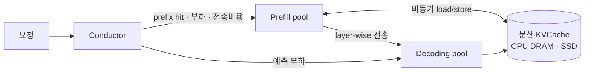

KVCache 를 스케줄링의 중심에 두면 prefill·decode 분리의 이득이 SLO 안의 유효 throughput 으로 바뀐다.

## 문제와 핵심 아이디어

Kimi 같은 MaaS 는 요청마다 입력·출력 길이와 도착 분포가 제각각이고, 수익은 SLO(TTFT·TBT)를 지키면서 처리한 요청 수, 즉 유효 throughput 에 달려 있다. throughput 을 올리는 두 길이 서로 충돌한다는 것이 출발점이다. KVCache 를 최대한 재사용하면 계산이 줄지만 원격에서 가져오느라 TTFT 가 늘고, batch 를 키우면 MFU 는 오르지만 TBT 가 커진다. 그래서 저자들은 KVCache 의 배치와 이동을 서빙 스케줄링의 중심 문제로 놓는다.

발상은 두 가지가 겹친다. 첫째, prefill 클러스터와 decoding 클러스터를 분리하고, GPU 노드에서 놀고 있던 CPU·DRAM·SSD 를 묶어 분리형 KVCache 풀로 쓴다. 둘째, 전역 스케줄러 Conductor 가 요청마다 prefill 인스턴스와 decoding 인스턴스 쌍을 고를 때 부하만이 아니라 prefix 캐시 hit 길이와 재사용 가능한 KV block 의 분포를 같이 본다. 여기에 과부하 상황을 처음부터 전제하고, 받아도 SLO 를 못 지킬 요청은 prefill 전에 미리 거절하는 정책을 얹는다.

## 동작 방식

요청이 오면 Conductor 가 prompt 를 block 단위로 해시해 어느 prefill 인스턴스가 얼마나 긴 prefix 를 이미 갖고 있는지 본다. 가장 긴 prefix 를 가진 인스턴스가 무조건 이기는 것은 아니고, 그 인스턴스의 대기열을 고려한 추가 prefill 시간과 원격 캐시를 끌어오는 전송 시간을 견주어 더 짧은 쪽을 고른다. 전송이 더 싸면 대체 인스턴스가 보유자로부터 KVCache 를 가져와 로컬에 두고, 자주 쓰이는 prefix 는 여러 인스턴스에 복제되어 캐시 부하가 자연스럽게 분산된다. 미래 사용량을 예측하는 대신 이런 휴리스틱으로 캐시 부하 분산을 처리하는데, MaaS 워크로드가 너무 빨리 변해 예측이 맞지 않는다는 것이 이유다.

prefill 쪽은 VRAM 점유를 줄이는 데 집중한다. 어떤 요청의 KVCache 점유 비용을 크기 × 시간으로 보고, layer 별로 계산이 진행되는 동안 다음 layer 의 KVCache 로딩과 이전 layer 의 저장을 비동기로 겹친다. 그러면 prefill 노드는 VRAM 에 요청 하나만 담을 수 있으면 되고, 스케줄링은 KVCache 분포와 DRAM 여유만 보면 된다. 긴 prompt 는 여러 노드에 걸친 multi-node prefill 로 나눈다.

과부하 처리는 decoding 쪽 부하를 prefill 시작 전에 보는 것이 핵심이다. prefill 을 다 하고 나서 decoding 이 거절하면 prefill 계산이 통째로 낭비되므로, 도착 시점에 두 풀 중 더 큰 부하를 기준으로 수락 여부를 정한다. 다만 지금 부하로만 판단하면 두 풀의 부하가 번갈아 출렁이는 진동이 생겨서, 각 요청의 decoding 시간이 균일하다고 가정하고 일정 시간 뒤 decoding 풀의 평균 TBT 를 시스템 수준에서 추정해 그 예측값으로 거절한다.

## 결과 수치

baseline 은 vLLM 이고, TTFT 와 TBT 의 P90 이 임계 안에 드는 최대 요청률로 비교한다. 공개 데이터셋(ArXiv Summarization, L-Eval)과 긴 prompt 시뮬레이션에서 Mooncake 는 SLO 를 지키면서 throughput 을 최대 525% 까지 높였고, 이득은 16k 부터 128k 까지 prompt 가 길수록 컸다. 실제 Kimi 트레이스를 재생한 부하 테스트에서는 같은 GPU 수로 75% 더 많은 요청을 처리했다. 과부하 실험(8P+8D, 실제 요청 23,000개를 2배속 재생)에서는 예측 기반 조기 거절이 단순 조기 거절보다 거절 수를 줄이면서 부하 진동을 없앴다.

## 관련

- [DistServe](/papers/#distributed) — 같은 prefill·decoding 분리를 goodput 최적화 관점에서 정식화한 논문. Mooncake 는 여기에 KVCache 풀과 과부하 정책을 더한 프로덕션 판이다.
- [Splitwise](/papers/#distributed) — 두 단계를 다른 머신에 나눈다는 발상의 또 다른 원류. 하드웨어 이질성에 초점.
- [MemServe](/papers/#kv-cache) — 분리형 서빙에 탄력적 메모리 풀과 컨텍스트 캐싱을 통합. Mooncake 의 KVCache 풀과 가장 가까운 설계.
- [LMCache](/papers/#kv-cache) — 오픈소스 KV 캐시 계층. Mooncake 의 전송 엔진이 백엔드 중 하나로 붙는다.

## 한계와 의심

논문의 모든 수치는 Kimi 의 자체 클러스터와 트레이스에서 나온 것이라 다른 워크로드에서 525% 가 재현될지는 알 수 없다. 조기 거절은 유효 throughput 을 지키는 대신 사용자를 돌려보내는 정책이라, 거절된 요청의 경험은 평가 지표에 들어 있지 않다. 캐시 부하 분산이 휴리스틱인 점은 저자들도 인정하고, 예측 기반 거절의 균일한 decoding 시간 가정은 출력 길이 편차가 큰 워크로드에서 약해질 수 있다.
